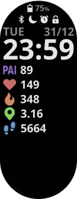

# tobimi-watchface

_Simple Xiaomi Smart Band 7 watchface_



## Table of Contents

- [Introduction](#introduction)
- [Development](#development)
- [Sync to your device](#sync-to-your-device)
- [Resources](#resources)

## Introduction

This watchface focus to be simple by presenting only information for my daily usage.

## Development

1. Make sure to have [Node.js](https://nodejs.org/en) installed into your machine.
2. _OPTIONAL_ - To make things easier during the development install [Zepp OS Simulator](https://docs.zepp.com/docs/1.0/guides/tools/simulator/).
3. Clone this repo.
4. Then, with your favorite command prompt install the dependecies:

```
npm installl
```

5. Done! You're ready to start developing.

Check the [Resources section](#resources) to read more about the Zepp OS Watchface API and the simulator which is very useful.

## Sync to your device

To sync this watchface to your device you need first build the project and then sync it.

### Building

1. To build the project:

```
npm run build
```

2. It'll prompt the following question. Select the `l66` option only and press Enter.

```
? Which targets would you like to build? (Press <space> to select, <a> to toggle all, <i> to invert selection, and <enter> to
proceed)
❯◉ l66
 ◯ 194x368-amazfit-band7
```

3. After the building process is finished, it'll generate a bin file (actually is zip file) at `output` directory. This is will be used to be synchronized to your band.

### Sync with band

Use [Mi Band 7 Watch Faces](https://play.google.com/store/apps/details?id=asn.ark.miband7) or similar app and sync the bin file:

- I usually upload the bin file to Google Drive or similar cloud file storage solution and download it in my phone.
- Then open 'Zepp Life' and 'Mi Band 7 Watch Faces' apps. In 'Mi Band 7 Watch Faces' app go to "Install your watch face" > "Choose .bin file" to select the watchface bin file.
- Select "Add Watch Face" option and check if your device is being show at devices list. If yes, select "Set Watchface".

Another solution, according with [matusmisiak](https://github.com/matusmisiak), you can copy directly `output` directory to `storage/emulated/0/Android/data/com.xiaomi.hm.health/files/watch_skin_local/` on your phone and install using Zepp Life, although it is only possible on versions earlier than 6.3.3.

## Resources

The resources I used to create this watchface are:

- [Zepp OS Developer Documentation](https://docs.zepp.com/docs/1.0/intro/)
- [Zepp OS Simulator](https://docs.zepp.com/docs/1.0/guides/tools/simulator/)
- [Watchface and Application code examples for ZeppOS](https://github.com/zepp-health/zeppos-samples/tree/main)
- [classic-watchface repo by matusmisiak](https://github.com/matusmisiak/classic-watchface)

Theme font: Noto Sans
